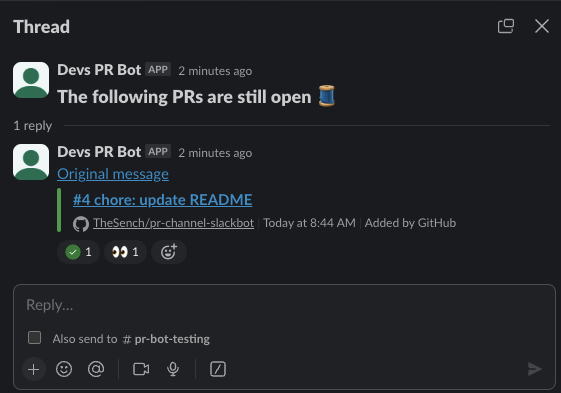

# PR Channel Slackbot

A GitHub Action that monitors Slack channels for open pull requests and automatically marks them merged, closed, or approved — keeping your PR review channel clean and up to date.



## Contents

- [Recommended Practices](#recommended-practices)
- [Quick Start](#quick-start)
- [How it Works](#how-it-works)
- [Reference](#reference)
- [Advanced Usage](#advanced-usage)
- [Migrating from v1](#migrating-from-v1)
- [License](#license)

## Recommended Practices

This action is designed around a pull request review workflow that uses a dedicated Slack channel. The following practices make the most of what it provides:

1. **Create a Dedicated Slack Channel**: Establish a separate channel specifically for pull requests, such as `#pr-reviews` or `#pull-requests`. This keeps review requests visible and avoids cluttering general development channels.

2. **Post Pull Request Links**: Developers post links to their pull requests in the dedicated channel when they are ready for review. This signals that feedback is welcome and gives the bot a message to react to.

   > [!NOTE]
   > It is recommended that each pull request is posted in its own message. Messages containing multiple pull requests are supported, but there is no way to indicate the status of them individually via reactions.

3. **Use Reactions for Review Status**: These reactions indicate that a pull request has already received attention, so other reviewers can prioritize accordingly.
   - **Approval**: Add an "approved" reaction (e.g., ✅) once you have approved the pull request.
   - **Changes Requested**: Add a "changes requested" reaction (e.g., 🔄) to indicate modifications are needed before the pull request can be approved.

4. **Use Reactions for Pull Request Closure**: These reactions tell the bot (and your teammates) that a pull request no longer needs review.
   - **Merged**: Add a "merged" reaction (e.g., 🚀) when a pull request is merged. The bot can also add this automatically.
   - **Closed**: Add a "closed" reaction (e.g., ❌) when a pull request is closed without merging. The bot can also add this automatically.

## Quick Start

Get up and running in about 5 minutes.

### Prerequisites

- **Slack bot token** with the following scopes:
  - `channels:history` — read public channel history
  - `groups:history` — read private channel history (for channels the app is invited to)
  - `chat:write` — post messages
  - `reactions:write` — add emoji reactions to messages

  [Create a Slack app and get a token →](https://api.slack.com/tutorials/tracks/getting-a-token)

- **GitHub token** with access to the repos whose PRs you want to monitor:
  - Fine-grained: `pull_requests:read`
  - Classic: `repo`

  > [!NOTE]
  > This action uses two separate tokens for different purposes:
  > - The workflow's **default `GITHUB_TOKEN`** (granted via the `contents: write` job permission) is used to commit the state file back to the workflow repo.
  > - The **`github-token` input** reads PR statuses from the repos being monitored — these are typically different repos, so the default `GITHUB_TOKEN` won't work here.

- If using [Persistent PR Tracking](#persistent-pr-tracking-trackunresolved): a repository where the GitHub Actions actor has push access. See that section for the full workflow setup, or opt out by setting `trackUnresolved: false`.

### 1. Create a config file

Add `.github/pr_channel_slackbot_config.json` to your repo:

```json
{
    "channels": {
        "my-prs": {
            "channelId": "C123456"
        }
    }
}
```

Replace `C123456` with your channel's ID. To find it: right-click the channel in Slack → **Copy link** — the ID is the last segment of the URL (e.g. `https://mycompany.slack.com/archives/C123456`).

### 2. Add a workflow

Add `.github/workflows/pr_channel_slackbot.yml`:

```yaml
name: PR Channel Slackbot

on:
  workflow_dispatch:
  schedule:
    # At 12:00 and 17:00 (UTC) every weekday
    - cron: '0 12,17 * * 1-5'

jobs:
  pr-channel-slackbot:
    runs-on: ubuntu-latest
    permissions:
      contents: write  # Allows the default GITHUB_TOKEN to commit the state file
    steps:
      - name: Checkout Repository
        uses: actions/checkout@v6  # Required to read the config file and write the state file
        with:
          # Use token with write access to bypass PR checks for state file commits
          token: ${{ secrets.TOKEN_WITH_WRITE_ACCESS }}

      - name: Configure git user
        run: |
          git config user.name "github-actions[bot]"
          git config user.email "41898282+github-actions[bot]@users.noreply.github.com"

      - name: PR Channel Slackbot
        uses: TheSench/pr-channel-slackbot@v2
        with:
          slack-token: ${{ secrets.SLACK_TOKEN }}
          github-token: ${{ secrets.PR_BOT_GITHUB_TOKEN }}
          config-file: '.github/pr_channel_slackbot_config.json'
          state-file: '.github/pr-channel-state.json'

      - name: Commit state file
        run: |
          git add .github/pr-channel-state.json
          if ! git diff --cached --quiet; then
            git commit -m "chore: update PR channel state [skip ci]"
            git push
          fi
```

### 3. Store your secrets

In your repo, go to **Settings → Secrets and variables → Actions** and add:

| Secret | Value |
|--------|-------|
| `SLACK_TOKEN` | Your Slack bot token |
| `PR_BOT_GITHUB_TOKEN` | Your GitHub token with access to the monitored repos |

That's it. On the next scheduled run (or via **Actions → PR Channel Slackbot → Run workflow**), the bot will scan your Slack channel and post a digest of open pull requests.

## How it Works

For each configured Slack channel, the action runs these steps:

1. **Read Chat History**: Scans channel messages (excluding thread replies) to find messages containing GitHub pull request links.

2. **Check Pull Request Status**: For each pull request link found:
   - If the message already has a `closed` or `merged` reaction, it is skipped.
   - The action queries GitHub for the pull request's status. If it is merged or closed, the corresponding reaction is added to the Slack message (and to its entry in the previous digest thread, if one exists). The action then moves on.
   - If the pull request is still open, the action checks its review status. If changes have been requested, the `changesRequested` reaction is added. Otherwise, if there are approvals, the `approved` reaction is added.

3. **Create a New Digest Thread**: After processing all messages, the action posts a new thread in the channel summarizing open pull requests. If a previous digest thread exists, a reply is added to it linking to the new one. This step (and the next two) can be skipped with `skip-digest: true` — see [Reaction-Only Mode](#reaction-only-mode-skip-digest).

4. **Add Digest Entries**: One reply per open pull request message is added to the new thread.

5. **Copy Reactions** *(optional)*: If `enableReactionCopying` is enabled for the channel, reactions from the original message are copied to the digest thread entry.

### Handling Messages with Multiple Pull Requests

When a message contains links to more than one pull request, the action uses the aggregate status to decide how to react:

1. **All closed without merge** → message is treated as "closed"
2. **All closed, at least one merged** → message is treated as "merged"
3. **All approved, none with changes requested** → message is treated as "approved"

## Reference

### Token Permissions

This action uses two tokens for different purposes:

| Token | Purpose | Where configured |
|-------|---------|-----------------|
| Default `GITHUB_TOKEN` | Commits the state file back to the workflow repo | `permissions: contents: write` on the job |
| `github-token` input | Reads PR statuses from the repos being monitored | `secrets.PR_BOT_GITHUB_TOKEN` |

#### Slack Token

A valid Slack API bot token is required to read and post messages. This can be a token for an existing Slack app, or you can [create a new one](https://api.slack.com/tutorials/tracks/getting-a-token). All messages are posted as the app tied to the provided token.

To read and post in private channels, the app must be invited to those channels in Slack.

Required bot token scopes:

- `channels:history` — read public channel history
- `groups:history` — read private channel history
- `chat:write` — post messages
- `reactions:write` — add emoji reactions

#### GitHub Token (`github-token` input)

The `github-token` input is used to query pull request status and review information from GitHub. It must have access to every repository whose PRs appear in your monitored channels.

> [!WARNING]
> The default `GITHUB_TOKEN` will not work here. It is scoped to the repository running the workflow, not the repositories being monitored. Use a dedicated token (stored as `PR_BOT_GITHUB_TOKEN` or similar) with access to the target repos.

If the token cannot access a repository, automatic reactions are disabled for that repo's PRs, and the bot falls back to using only manually-added `merged`/`closed` reactions to determine status.

Required permissions:

- Fine-grained access tokens: `pull_requests:read`
- Classic access tokens: `repo`

### Action Inputs

| Input | Required | Default | Description |
|---|---|---|---|
| `slack-token` | yes | | Slack API bot token |
| `github-token` | yes | | GitHub API token for reading PR statuses from monitored repos |
| `config-file` | yes | | Path to the JSON configuration file |
| `skip-digest` | no | `false` | When `true`, skips posting the open PR digest thread to Slack. Closed/merged PR reactions still fire normally. |
| `state-file` | no | `./pr-channel-state.json` | Path to the state file used for persistent unresolved PR tracking. Only written when at least one channel has `trackUnresolved: true`. Requires `contents: write` permission on the workflow. |

### Configuration File

The configuration file (e.g., `.github/pr_channel_slackbot_config.json`) has two sections: `reactions` and `channels`.

Example:

```json
{
    "reactions": {
        "merged": [
            "merged"
        ],
        "closed": [
            "pr-closed",
            "closed"
        ],
        "changesRequested": [
            "changes-requested"
        ],
        "approved": [
            "approved"
        ]
    },
    "channels": {
        "project-foo-prs": {
            "channelId": "C123456",
            "limit": 100,
            "maxPages": 2,
            "trackUnresolved": true
        },
        "project-bar-prs": {
            "channelId": "C654321",
            "enableReactionCopying": true
        },
        "project-baz-prs": {
            "channelId": "C987654",
            "limit": 50,
            "disabled": true
        }
    }
}
```

#### Reactions

Each reaction type accepts a list of emoji names. When checking existing reactions, all names in the list are recognized. When the bot adds a reaction, it uses the first name in the list.

| Key | Behavior |
|-----|----------|
| `merged` | Messages with this reaction are skipped. Added automatically when a PR is merged. |
| `closed` | Messages with this reaction are skipped. Added automatically when a PR is closed without merging. |
| `changesRequested` | Does not affect message processing. Added when a PR has open change requests. |
| `approved` | Does not affect message processing. Added when a PR has approvals and no change requests. |

#### Channels

The `channels` section is a map of human-readable names to channel configurations. The key names are for your reference only and do not affect processing. Use names that match your actual Slack channel names for clarity.

Each channel configuration supports:

| Field | Required | Default | Description |
|-------|----------|---------|-------------|
| `channelId` | yes | | The Slack channel ID. Right-click the channel → **Copy link** — the ID is the last segment of the URL. |
| `limit` | no | `50` | Maximum messages to fetch per page of Slack history. |
| `maxPages` | no | `1` | Maximum pages of history to fetch. Increase for high-volume channels where PRs may scroll off a single page. When `trackUnresolved` is enabled, pagination stops early once the previous digest thread is found. |
| `trackUnresolved` | no | `true` | Persists unresolved PR message timestamps between runs so long-running PRs are never dropped from the digest. Requires `state-file` input and `contents: write` workflow permission. |
| `allowBotMessages` | no | `true` | When `true`, messages posted by bots are eligible for PR tracking. Set to `false` to skip bot messages. |
| `disabled` | no | `false` | Set to `true` to temporarily disable a channel without removing it from the config. |
| `enableReactionCopying` | no | `false` | When `true`, reactions from the original message are copied to the digest thread entry. |

## Advanced Usage

### Persistent PR Tracking (`trackUnresolved`)

By default (`trackUnresolved: true`), the bot persists the list of unresolved PR message timestamps and the last digest thread timestamp to a JSON state file after each run. On subsequent runs, it fetches any previously-tracked messages that fall outside the current pagination window — ensuring long-running PRs are never dropped from the digest.

The state file is automatically committed and pushed back to the repository after each run (skipped if nothing changed).

**Requirements:**

- Set `contents: write` on the job permissions
- Include `actions/checkout@v4` before the bot step
- Configure git user identity before the bot step
- Commit and push the state file after the bot step
- Provide the `state-file` input (defaults to `./pr-channel-state.json`)

```yaml
permissions:
  contents: write
```

**To opt out**, set `trackUnresolved: false` on each channel in your config:

```json
{
    "channels": {
        "my-prs": {
            "channelId": "C123456",
            "trackUnresolved": false
        }
    }
}
```

When disabled, you can also remove the `contents: write` permission and the `state-file` input from your workflow.

### Reaction-Only Mode (`skip-digest`)

Use `skip-digest: true` when you want the bot to mark merged/closed PRs with reactions without posting a new digest thread every time it runs.

A common pattern is to post a full digest on a regular schedule and run reaction-only cleanup more frequently:

```yaml
name: PR Channel Slackbot

on:
  workflow_dispatch:
    inputs:
      skip-digest:
        description: 'Skip posting the open PR digest'
        type: boolean
        default: true
  schedule:
    # Run every hour on weekdays
    - cron: '0 * * * 1-5'

jobs:
  pr-channel-slackbot:
    runs-on: ubuntu-latest
    permissions:
      contents: write
    steps:
      - name: Checkout Repository
        uses: actions/checkout@v6
        with:
          token: ${{ secrets.TOKEN_WITH_WRITE_ACCESS }}

      - name: Configure git user
        run: |
          git config user.name "github-actions[bot]"
          git config user.email "41898282+github-actions[bot]@users.noreply.github.com"

      # When run via CRON, create digests at 8AM and 1PM ET
      - name: Determine skip-digest
        id: opts
        run: |
          if [[ "${{ github.event_name }}" == "schedule" ]]; then
            HOUR=$(TZ="America/New_York" date +%-H)
            if [[ "$HOUR" == "8" ]] || [[ "$HOUR" == "13" ]]; then
              echo "skip-digest=false" >> "$GITHUB_OUTPUT"
            else
              echo "skip-digest=true" >> "$GITHUB_OUTPUT"
            fi
          else
            echo "skip-digest=${{ inputs.skip-digest }}" >> "$GITHUB_OUTPUT"
          fi

      - name: Open PRs
        uses: TheSench/pr-channel-slackbot@v2
        with:
          slack-token: ${{ secrets.SLACK_TOKEN }}
          github-token: ${{ secrets.PR_BOT_GITHUB_TOKEN }}
          config-file: '.github/pr_channel_slackbot_config.json'
          state-file: '.github/pr-channel-state.json'
          skip-digest: ${{ steps.opts.outputs.skip-digest }}

      - name: Commit state file
        run: |
          git add .github/pr-channel-state.json
          if ! git diff --cached --quiet; then
            git commit -m "chore: update PR channel state [skip ci]"
            git push
          fi
```

## Migrating from v1

### `disableReactionCopying` → `enableReactionCopying`

The `disableReactionCopying` field has been replaced by `enableReactionCopying` with inverted semantics. Reaction copying is now **opt-in** (disabled by default).

- Had `"disableReactionCopying": true` → replace with `"enableReactionCopying": false` (or simply omit it — no behavior change; reactions still not copied)
- Had `"disableReactionCopying": false` or omitted → add `"enableReactionCopying": true` if you want reactions copied (this was previously the default; now opt-in)

### `trackUnresolved` now defaults to `true`

Previously this field didn't exist and unresolved tracking was always off. In v2 it is on by default.

- Requires adding `contents: write` permission to your workflow job, a `git config` step to set user identity, a commit-and-push step after the bot runs, AND the workflow actor must be allowed to commit directly to the branch.
- To restore the old behavior, explicitly set `"trackUnresolved": false` on each channel.

### `allowBotMessages` now defaults to `true`

Previously bot messages were always blocked. In v2 they are included by default.

- To restore the old behavior, explicitly set `"allowBotMessages": false` on each channel.

## License

This project is licensed under the [MIT License](LICENSE).
